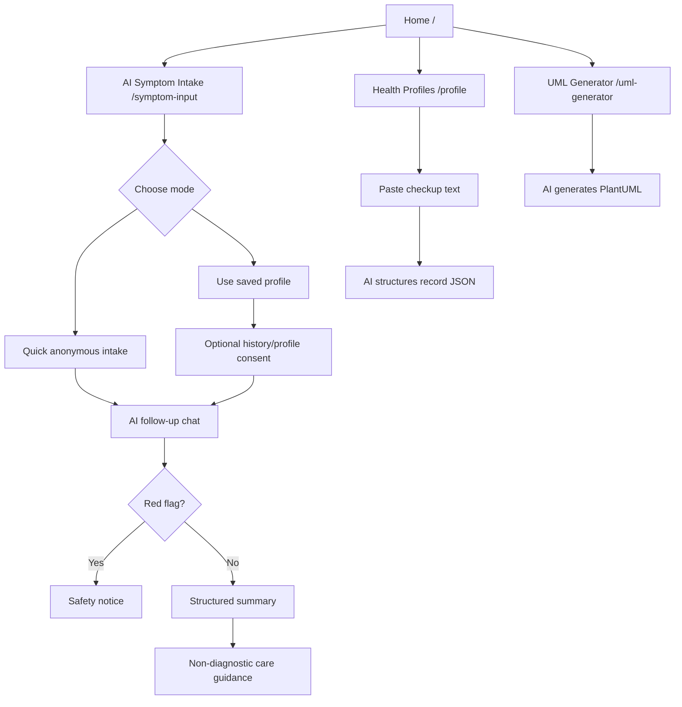

# 网站流程与 UML 说明

## 当前功能边界

当前版本聚焦文本式 AI 医疗预问诊原型：

- 用户选择快速采集或已有健康档案。
- AI 进行对话式追问。
- 后端先执行红旗症状安全规则。
- AI 生成结构化症状摘要和非诊断型护理建议。
- 用户可粘贴体检单文字，由 AI 结构化为统一 JSON。
- 用户可输入业务问题，由 Flask 后端调用 APIFree 生成 PlantUML。

地图搜索、浏览器定位、图片识别和个人报告图片生成已从最终版本移除。

## 主要页面流程

## UML 使用说明

- Use Case Diagram：明确 Patient/User、Student/Developer、AI Service 和 Clinician/Pharmacist 的边界。
- Activity Diagram：展示红旗症状检查必须发生在 AI 护理建议之前。
- Sequence Diagram：展示浏览器只调用 Flask，APIFree key 和 AI 调用留在后端。
- Class Diagram：说明 UserProfile、HealthRecord、UserSession、SymptomInput、FollowUpQuestion、SymptomSummary、CareGuidance 和 UMLDiagram 的关系。

## 安全设计重点

- 非诊断范围。
- 不生成处方或个性化剂量。
- 红旗症状优先走本地规则。
- 用户授权后才允许模型参考档案和历史记录。
- 体检单只支持手动粘贴文字，不上传或识别图片。
